# Installation instructions

The following instructions will show you how to set up your machine in preparation for the course.

Please complete these steps **before** the course so that we can spend as much time as possible on the course content!

- Sections:
  1. [Downloading the course materials](#1-downloading-the-course-materials)
  2. [Installing Conda](#2-installing-conda)
  3. [Installing Python and MNE](#3-installing-python-and-mne)
  4. [Setting up an IDE for Python and Jupyter notebooks](#4-setting-up-an-ide-for-python-and-jupyter-notebooks)
  5. [Opening the course materials in the IDE](#5-opening-the-course-materials-in-the-ide)

<br>

If at any point you get stuck, remember that Google is your friend! You are probably not the only person to ever encounter this issue, so try searching for the error message you are seeing.

If you are unable to find a solution this way, you can get in touch via [email](mailto:thomas-samuel.binns@charite.de) and we will try to help.

<br>

## 1. Downloading the course materials

For those who are comfortable using Git, you can of course clone the GitHub repository containing the course materials, e.g.:
```
git clone https://github.com/tsbinns/mne_course.git
```
Naturally, you should clone it to a sensible location where you will be able to find it again, e.g. in a folder called `GitHub` in your home directory.

Cloning the repository will be the easiest way to update the course materials when new content is added each day, so this is recommended.

<br>

If you are unfamiliar with Git and cloning repositories from GitHub, GitHub provides a [tutorial](https://docs.github.com/en/repositories/creating-and-managing-repositories/cloning-a-repository) for doing so (this requires that you have [Git](https://git-scm.com/) installed).

For those who prefer a GUI to working on the command line, you may find the [GitHub Desktop](https://desktop.github.com/) programme very useful for cloning the repository.

<br>

If you still feel uncomfortable with cloning from GitHub, you can also download the repository as a `.zip` file. To do this:
1. Go to the [GitHub page](https://github.com/tsbinns/mne_course) for the course repository.

<br>

2. Click the green `Code` button. A drop-down menu will appear.

<br>

3. On the `Local` tab of the drop-down menu, click the `Download ZIP` button, e.g.:<br>
    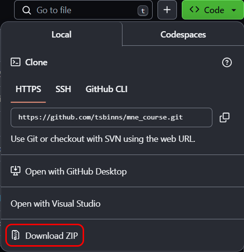

<br>

4. Save the `.zip` file to a location on your machine where you will be able to find it again, e.g. your `Downloads` folder.

<br>

5. Extract the contents of the `.zip` file to a sensible location, e.g. in a folder called `GitHub` in your home directory.

<br>

6. When downloading a repository from GitHub, it will include the branch name as a suffix, e.g. `-main`. Remove this suffix from the extracted folder name, so that it is simply `mne_course`.

<br>

In the cloned/downloaded folder, you should see the following contents:<br>
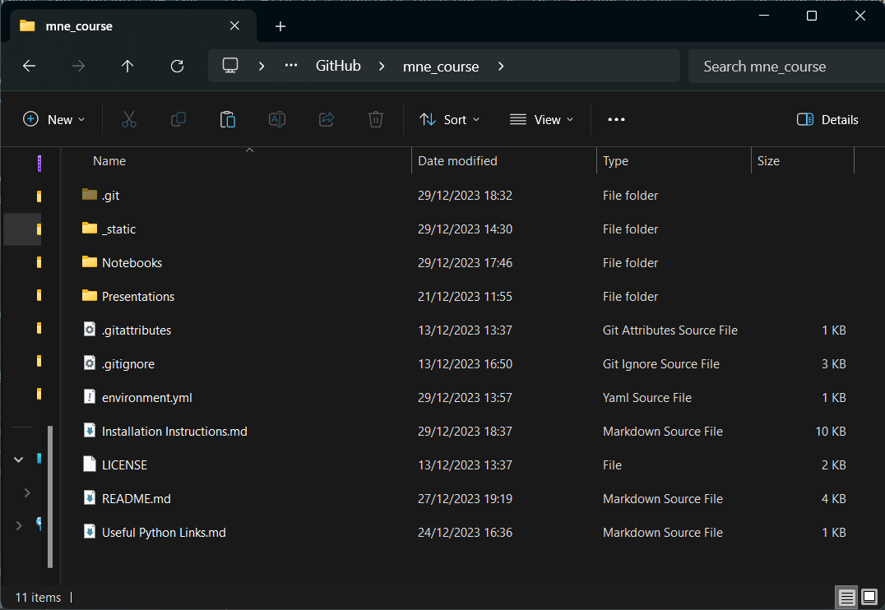

<br>

## 2. Installing Conda

If you already have Conda installed on your machine, you can skip to [Section 3](#3-installing-python-and-mne).

We will use [Conda](https://conda.io/projects/conda/en/latest/index.html) as our [environment](https://conda.io/projects/conda/en/latest/user-guide/concepts/environments.html) manager, offering an easy way to install Python and all the packages we will need for the course.

We will install Conda via the [Anaconda](https://docs.anaconda.com/) distribution. Follow these instructions for installing Anaconda on:
- [Windows](https://docs.anaconda.com/free/anaconda/install/windows/)
- [MacOS](https://docs.anaconda.com/free/anaconda/install/mac-os/)
- [Linux](https://docs.anaconda.com/free/anaconda/install/linux/)

<br>

## 3. Installing Python and MNE

Once Conda has been installed, we will use this to install Python and the packages we will need for the course, such as MNE and its dependencies.

Even if you already have an environment where MNE is installed, **please follow these instructions to create a new environment**, as there are required features of the most recent MNE versions which you may not have!

<br>

1. Open a terminal from which you can access `conda` commands, e.g. the Anaconda Prompt.<br>
   There are OS-specific instructions for [opening the Anaconda Prompt](https://docs.anaconda.com/free/anaconda/install/verify-install/#conda).<br>
    You should see something like this:<br>
    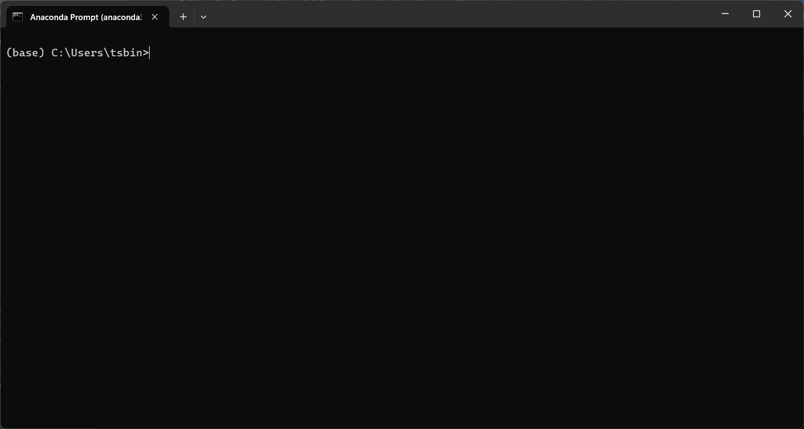

<br>

2. In the Anaconda Prompt, navigate to the location where you have downloaded the GitHub repository using the `cd` command, e.g.:
    ```
    cd GitHub/mne_course
    ```
    The exact path will depend on the default directory for your Anaconda Prompt, and the location of the GitHub repository.<br>
    The start of the command line should now show the path to the GitHub repository, e.g.:<br>
    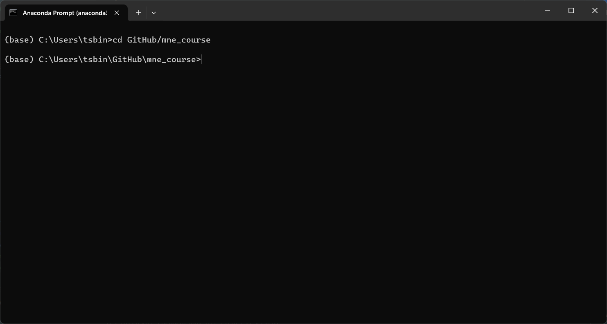

<br>

3. Create the environment containing Python and install the course dependencies from the `environment.yml` file, by running the following command in the Anaconda Prompt:
    ```
    conda env create --file=environment.yml --solver=libmamba
    ```
    This will create a new Conda environment called `mne_course` and install MNE and its dependencies in this environment.<br>
    **Be aware that this may take several minutes to run.**<br>
    You should see something like this:<br>
    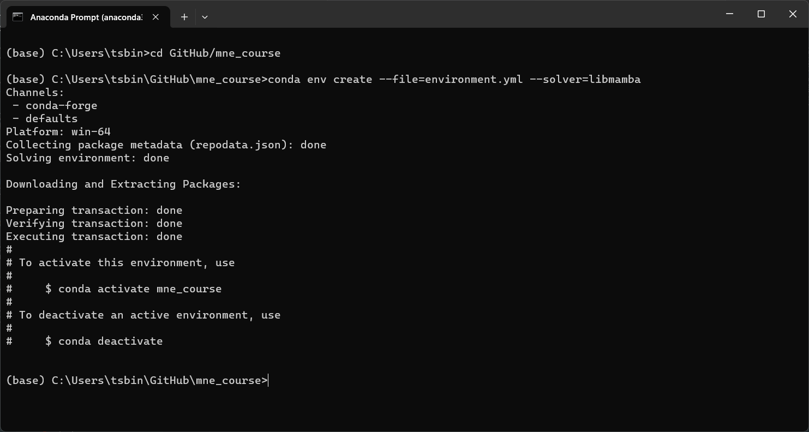

<br>

4. Activate the newly-created environment by running the following command in the Anaconda Prompt:
    ```
    conda activate mne_course
    ```
    You should see the name of the environment appear in parentheses at the start of the command line, like this:<br>
    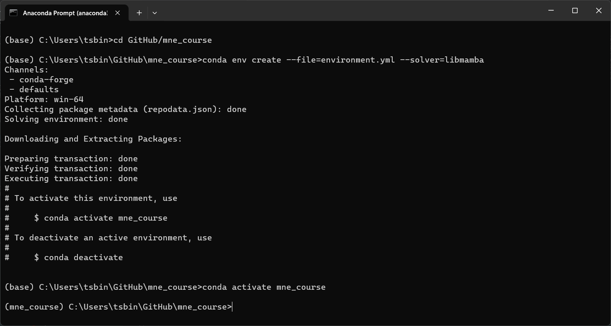

<br>

5. Verify that MNE has been installed by running the following command in the Anaconda Prompt:
    ```
    python -c "import mne; mne.sys_info()"
    ```
    You should see something like this:<br>
    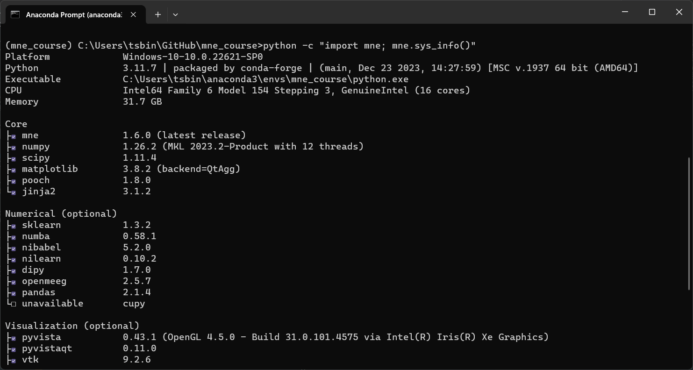

<br>

You can now close the Anaconda Prompt.

## 4. Setting up an IDE for Python and Jupyter notebooks

As the course content is based in [Jupyter notebooks](https://docs.jupyter.org/en/latest/), we need an [IDE](https://en.wikipedia.org/wiki/Integrated_development_environment) that supports these. We recommend [Visual Studio Code](https://code.visualstudio.com/) (VS Code).

If you prefer to use another IDE, you are welcome to do so, but you will need to adapt the instructions below to your IDE of choice.

If you already have an IDE installed and configured to work with Python and Jupyter notebooks, you can skip to [Section 5](#5-opening-the-course-materials).

<br>

1. [Download VS Code](https://code.visualstudio.com/#alt-downloads) for your OS.<br>
    See also the instructions for installing VS Code on:
    - [Windows](https://code.visualstudio.com/docs/setup/windows#_installation)
    - [MacOS](https://code.visualstudio.com/docs/setup/mac#_installation)
    - [Linux](https://code.visualstudio.com/docs/setup/linux#_installation)

    Once installed, open VS Code. You should see something like this:<br>
    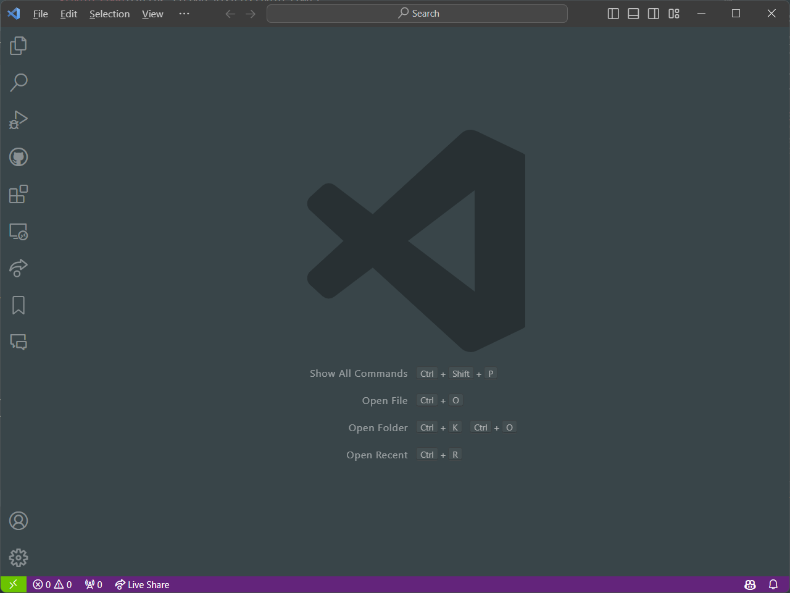

<br>

2. Install the [Python extension](https://marketplace.visualstudio.com/items?itemName=ms-python.python) for VS Code.<br>
    See also these [instructions for installing extensions](https://code.visualstudio.com/docs/editor/extension-marketplace#_install-an-extension) in VS Code.<br>
    You can view your installed extensions by navigating to `View > Extensions` in the top menu bar, e.g.:<br>
    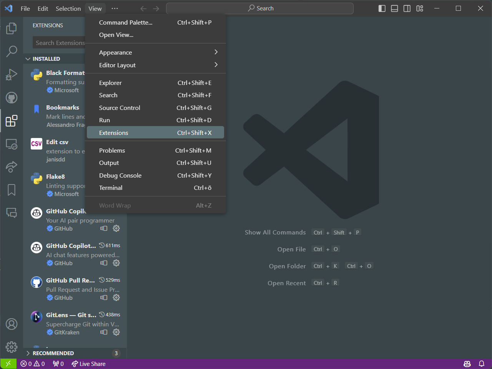


<br>

3. Install the [Jupyter extension](https://marketplace.visualstudio.com/items?itemName=ms-toolsai.jupyter) for VS Code.

<br>

## 5. Opening the course materials in the IDE

We will now open the course materials in our IDE.

Again, these instructions are tailored to VS Code, so if you are using a different IDE, you will need to adapt them.

<br>

1. Open the `Explorer` tab by navigating to `View > Explorer` in the top menu bar, e.g.:<br>
    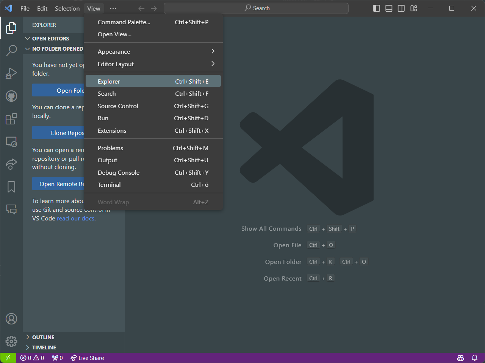

<br>

2. Click on the `Open Folder` button in the `Explorer` tab that opens on the left-hand side, and select the folder for the GitHub repository containing the course materials, e.g.:<br>
    


    <br>

    You should now see the course materials in the `Explorer` tab, e.g.:<br>
    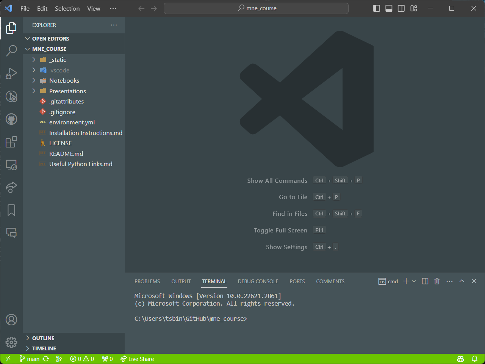


<br>

3. To verify that everything has been installed properly and to check that Jupyter notebooks are supported, open the test notebook file under [`Notebooks/test_notebook.ipynb`](./Notebooks/test_notebook.ipynb) in the `Explorer` tab.<br>
    You should see something like this:<br>
    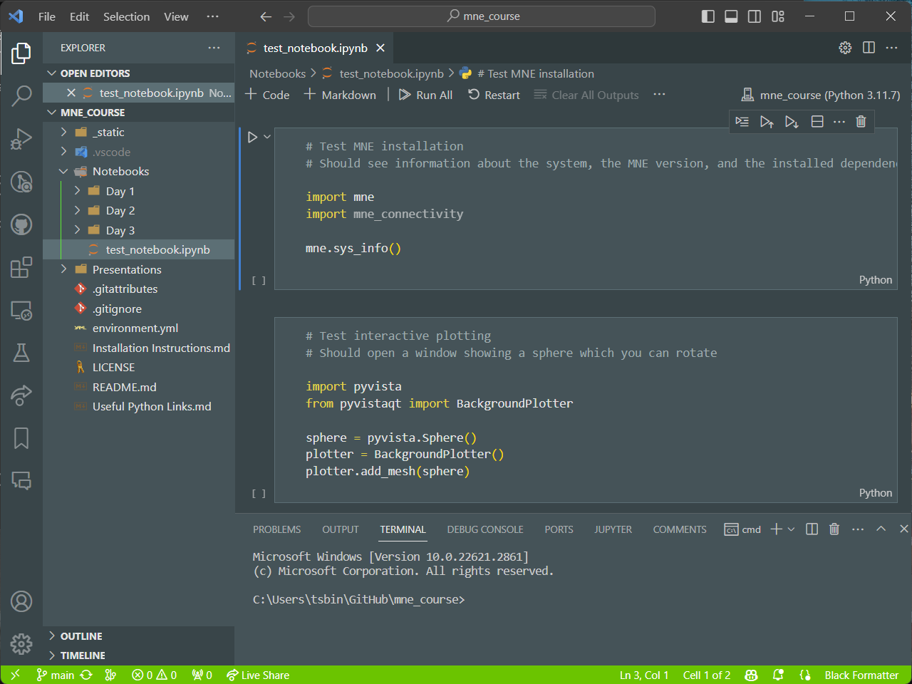


<br>

4. Activate a kernel which will be used to run the contents of the notebook. This will be the `mne_course` environment we created earlier.<br>
    Follow these instructions for [selecting a kernel](https://code.visualstudio.com/docs/datascience/jupyter-notebooks#_create-or-open-a-jupyter-notebook) in VS Code.<br>
    If the `mne_course` environment does not appear in the pop-up window, you may find it under `Select Another Kernel... > Python Environments... > mne_course`.

<br>

5. Run the first cell of the notebook to verify that MNE is available.<br>
    Follow these instructions for [running notebook cells](https://code.visualstudio.com/docs/datascience/jupyter-notebooks#_running-cells) in VS Code.<br>
    You should see a set of information output from the cell, similar to that seen in [Section 3](#3-installing-python-and-mne).

<br>

6. Run the second cell of the notebook to verify that the interactive plotting capabilities of MNE are available, which we will be using during the course.<br>
    You should see a new window be created, containing a 3D plot of a sphere which you can rotate by clicking and dragging with the mouse, e.g.:<br>
    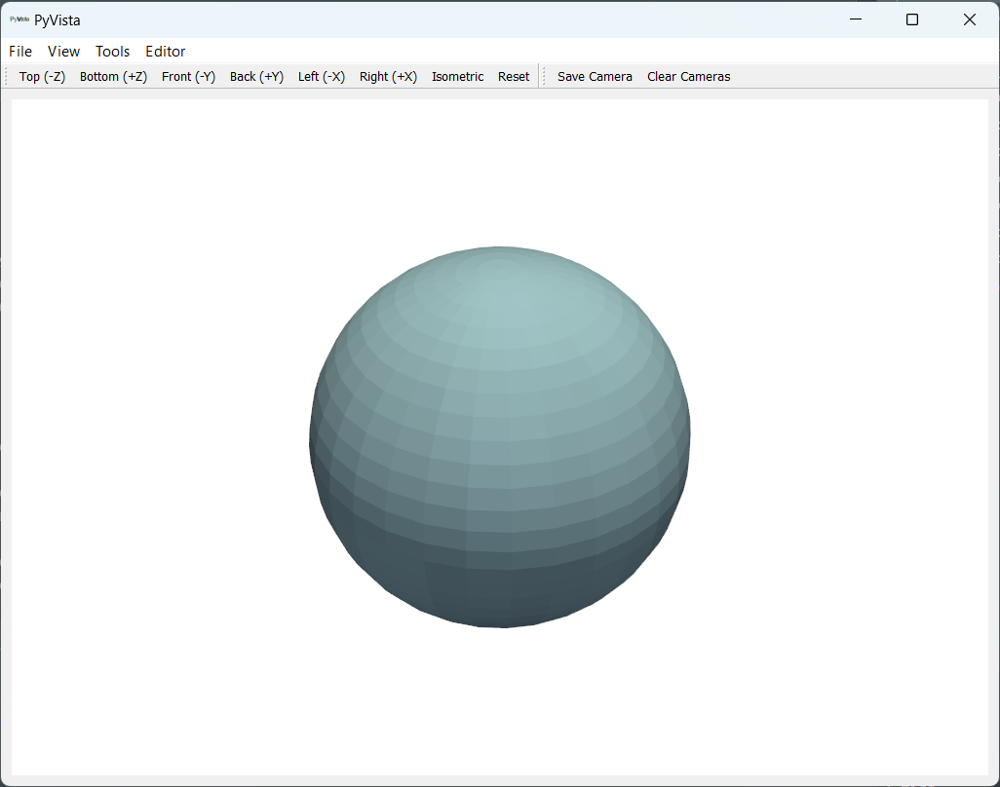


<br>

### If you have followed all of these steps, your machine should now be ready to run the course content!